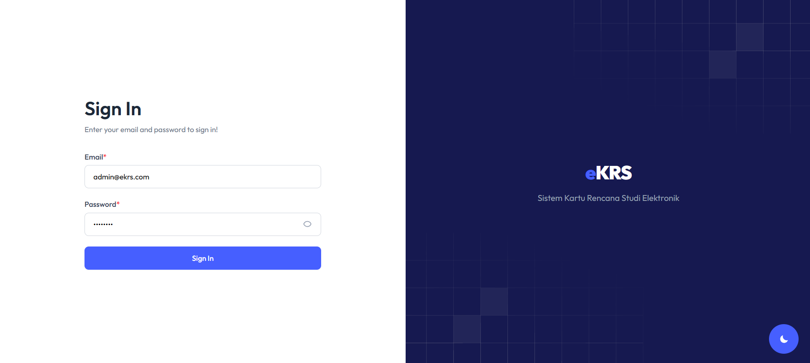
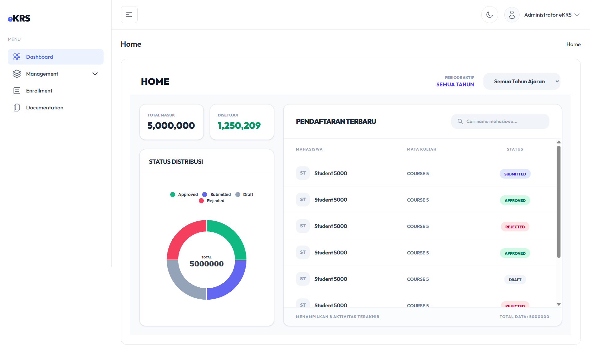

# Sistem eKRS – Elektronik Kartu Rencana Studi

## Deskripsi

Sistem ini dibangun menggunakan **Laravel (PHP)** untuk menangani proses manajemen Kartu Rencana Studi (KRS) dengan performa tinggi, mampu mengelola dataset hingga **5.000.000 baris data**.

Sistem mencakup manajemen **mahasiswa**, **mata kuliah**, **enrollment (KRS)**, fitur pencarian & filter canggih, serta **export data masif** berbasis streaming.

---

## Teknologi

- **Backend:** Laravel (PHP)
- **Frontend:** Livewire + Tailwind CSS
- **Database:** PostgreSQL
- **Autentikasi:** Laravel Auth

---

## Fitur Utama

### 1. Atomic Transaction (3 Tabel)
Setiap operasi create/update melibatkan transaksi database yang menjamin konsistensi data pada tabel `students`, `courses`, dan `enrollments` dengan prinsip **All-or-Nothing**. Jika terjadi kegagalan di tengah proses, sistem otomatis melakukan rollback.

### 2. Validasi Berlapis (Frontend & Backend)
- **Frontend:** Real-time feedback menggunakan Livewire — validasi terjadi saat pengguna mengetik, sebelum tombol simpan ditekan.
- **Backend:** Validasi server-side memastikan keamanan data meskipun request dikirim langsung via API tools. Mencakup pengecekan duplikasi NIM/email, aturan bisnis enrollment, dan pencocokan pola Regex untuk kode mata kuliah.

### 3. Server-Side Pagination & Sorting
Sistem tidak memuat semua 5 juta data ke browser. Database hanya mengirimkan 10–25 baris sesuai halaman aktif menggunakan `LIMIT` dan `OFFSET` PostgreSQL. Pengguna dapat mengurutkan data berdasarkan NIM, Nama, Kode MK, Semester, atau Status secara dinamis.

### 4. Quick Filter & Live Search
- **Quick Filter:** Filter berdasarkan parameter paling sering digunakan dalam administrasi akademik (tahun ajaran, semester, status). Bekerja real-time tanpa reload halaman.
- **Live Search:** Pencarian instan berdasarkan NIM, Nama Mahasiswa, dan Kode Mata Kuliah dengan mekanisme **debounce** untuk efisiensi query.

### 5. Advanced Filter (AND/OR Logic)
Mendukung pencarian multi-kondisi — pengguna dapat menggabungkan parameter Tahun Ajaran, Status, dan Kode MK secara bersamaan. Query dibangun dinamis menggunakan Laravel Query Builder untuk execution plan yang optimal.

### 6. Soft Deletes & Fitur Trash
Data yang dihapus tidak hilang permanen — melainkan ditandai via kolom `deleted_at` dan dipindahkan ke menu **Trash**. Administrator dapat melakukan **restore** data atau **force delete** secara permanen.

### 7. Export Streaming (5 Juta Baris)
Ekspor data ke format CSV menggunakan metode **streaming** — data dikirimkan langsung ke browser bit demi bit tanpa membebani RAM server. Mendukung dua mode:
- **Keseluruhan:** Mengunduh seluruh data mentah dari database.
- **Hasil Filter:** Mengunduh hanya data yang telah disaring.

---

## Skenario Pengujian

| Kode | Skenario |
|------|----------|
| TS-01 | Setup & Seed 5 Juta Data |
| TS-02 | Create dengan Atomic Transaction (3 Tabel) |
| TS-03 | Validasi Frontend (Livewire Real-time) |
| TS-04 | Validasi Backend (Security & Integrity) |
| TS-05 | Read Table & Server-Side Pagination |
| TS-06 | Sorting Server-Side |
| TS-07 | Quick Filter |
| TS-08 | Live Searching dengan Debounce |
| TS-09 | Advanced Filter (AND Logic) |
| TS-10 | Advanced Filter (OR Logic) |
| TS-11 | Update Data dengan Validasi Berlapis |
| TS-12 | Delete dengan Soft Deletes & Trash |
| TS-13 | Export CSV 5 Juta Baris (Streaming) |

---

## Instalasi

### Persyaratan
- PHP >= 8.1
- Composer
- PostgreSQL

### Langkah-langkah

1. **Clone repositori:**
```bash
git clone https://github.com/syanufa11/eKRS
cd eKRS
```

2. **Install dependencies:**
```bash
composer update
```

3. **Copy file `.env.example` ke `.env` dan sesuaikan konfigurasi database:**
```bash
cp .env.example .env
```

4. **Generate APP_KEY:**
```bash
php artisan key:generate
```

5. **Jalankan migrasi dan seeder:**
```bash
php artisan migrate:fresh --seed
```

6. **Import data 5 juta baris (via PostgreSQL COPY): (sesuaikan dengan lokasi storage appnya)**
```sql
COPY enrollments(student_id, course_id, academic_year, semester, status, created_at, updated_at)
FROM '/path/to/storage/app/enrollments_unique.csv'
DELIMITER ',' CSV;
```

Verifikasi jumlah data:
```sql
SELECT COUNT(*) FROM enrollments;
-- Output: 5.000.000
```

7. **Jalankan server:**
```bash
php artisan serve
```

---

## Akun Default (Setelah Seeding)

> Setelah menjalankan migrate & seeder, gunakan akun berikut untuk login sebagai admin:

| Field    | Value             |
|----------|-------------------|
| Email    | admin@ekrs.com    |
| Password | password          |

---

## Struktur Project
```
.env.example
app/
artisan
composer.json
database/
package.json
public/
resources/
routes/

```

---

## Laporan Teknis

Laporan teknis lengkap mencakup implementasi seluruh skenario pengujian (TS-01 hingga TS-13), strategi seeding 5 juta data, penjelasan kode Atomic Transaction, Soft Deletes, Streaming Export, dan bukti pengujian dapat diakses melalui tautan berikut:

📄 **[Buka Laporan Teknis – Google Docs](https://docs.google.com/document/d/1fAwluqN60qymQJml4SoKel0-9pn96gRs9J1T2eg4txw/preview)**

> Laporan ini disusun sebagai dokumentasi resmi pengembangan Sistem eKRS skala besar oleh **Tasya Nurul Fadila**.

---

## Screenshot

### 1. Login

> Halaman login sistem eKRS. Pengguna memasukkan email dan password untuk mengakses dashboard. Akun default: `admin@ekrs.com` / `password`.



---

### 2. Dashboard

> Halaman utama setelah login. Menampilkan ringkasan statistik sistem seperti jumlah mahasiswa, mata kuliah, dan total enrollment yang terdaftar.



---

### 3. Data Course

> Halaman manajemen mata kuliah. Menampilkan daftar seluruh mata kuliah beserta kode, nama, dan jumlah SKS.


---

### 4. Form Course

> Form tambah/edit mata kuliah dengan validasi real-time (Livewire).


---

### 5. Alert Success Tambah Course

> Notifikasi sukses setelah data mata kuliah baru berhasil disimpan ke database.


---

### 6. Detail Mahasiswa

> Tampilan detail profil mahasiswa tertentu yang mencakup riwayat akademik dan informasi pribadi.


---

### 7. Form Tambah Enrollment

> Halaman pengisian KRS baru menggunakan transaksi atomik untuk menjaga integritas data.


---

### 8. Alert Success Tambah Enrollment

> Notifikasi sukses setelah proses enrollment (pengisian KRS) berhasil dilakukan.


---

### 9. Data Enrollment

> Halaman utama data enrollment (KRS). Menampilkan 5.000.000 baris data secara efisien menggunakan Server-Side Pagination.


---

### 10. Data Enrollment - Sorting Asc

> Fitur sorting ascending (A→Z) yang dieksekusi langsung di PostgreSQL pada 5 juta data.


---

### 11. Data Enrollment - Sorting Desc

> Fitur sorting descending (Z→A) yang dieksekusi di sisi server.


---

### 12. Data Enrollment - Filter Status

> Quick Filter berdasarkan status aktif/tidak aktif secara real-time menggunakan Livewire.


---

### 13. Data Enrollment - Filter Semester

> Penyaringan data enrollment berdasarkan semester tertentu.


---

### 14. Data Enrollment - AND

> Advanced Filter dengan logika AND (menggabungkan beberapa kondisi sekaligus).


---

### 15. Data Enrollment - OR

> Advanced Filter dengan logika OR untuk fleksibilitas pencarian.


---

### 16. Data Enrollment - Search NIM

> Fitur Live Search berdasarkan NIM dengan mekanisme debounce 300ms.


---

### 17. Data Enrollment - Search Nama

> Fitur Live Search berdasarkan Nama menggunakan index PostgreSQL untuk performa cepat.


---

### 18. Data Enrollment - Search Kode Mata Kuliah

> Pencarian instan berdasarkan kode mata kuliah tertentu.


---

### 19. Form Edit Enrollment

> Form untuk memperbarui data enrollment yang sudah ada dengan validasi berlapis.


---

### 20. Data Enrollment setelah update

> Tampilan tabel yang langsung diperbarui setelah data berhasil di-update tanpa reload.


---

### 21. Pilih Data Enrollment (untuk dihapus)

> Proses seleksi data enrollment yang akan dihapus dari sistem.

.png)

---

### 22. Konfirmasi Hapus ke Trash

> Dialog konfirmasi Soft Delete — memindahkan data ke tabel sampah tanpa menghapusnya dari disk.


---

### 23. Data Trash Enrollment

> Halaman Trash yang menampung data yang telah dihapus sementara.


---

### 24. Konfirmasi Restore

> Proses mengembalikan data dari Trash ke daftar aktif (Restore).


---

### 25. Konfirmasi Hapus Permanen

> Dialog konfirmasi untuk menghapus data secara permanen (Force Delete) dari database.


---

### 26. Export CSV (All)

> Proses memulai ekspor seluruh 5.000.000 baris data menggunakan metode streaming.

.png)

---

### 27. Hasil CSV (All)

> Bukti file CSV hasil ekspor data keseluruhan yang berhasil diunduh.

.png)

---

### 28. Export CSV (Filter)

> Proses ekspor data yang sudah difilter sebelumnya agar laporan lebih spesifik.

.png)

---

### 29. Hasil CSV (Filter)

> File CSV yang hanya berisi data sesuai kriteria filter pengguna.

.png)

---


---

## Pengembang

| Field   | Detail                                              |
|---------|-----------------------------------------------------|
| Nama    | Tasya Nurul Fadila                                  |
| Posisi  | Web Developer (Full Stack)                          |
| Topik   | Pengelolaan Data Akademik Skala Besar (5 Juta Data) |
